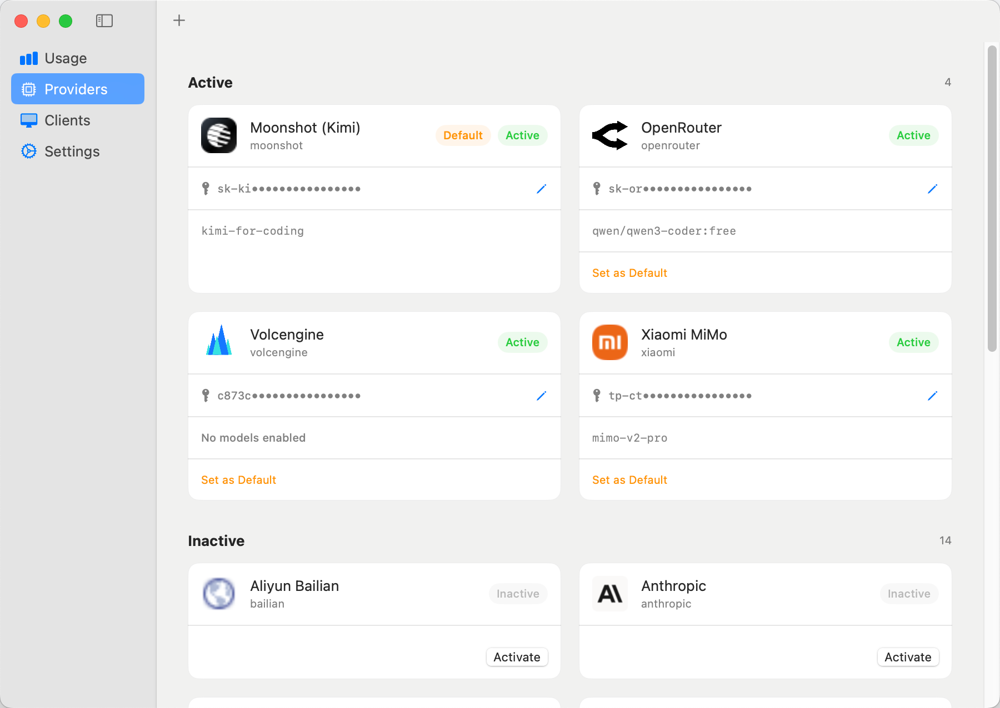
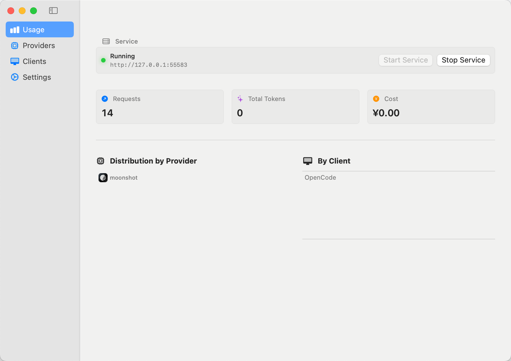
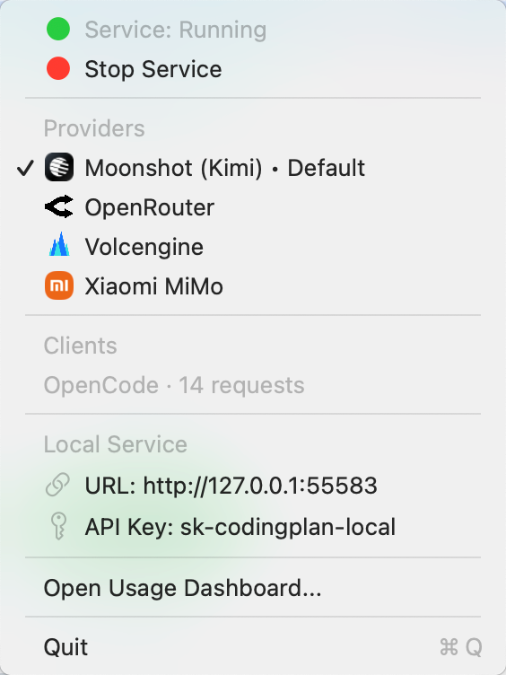

# CodingPlaner — 本地 AI 编码助手聚合网关

CodingPlaner 是一款专为开发者设计的 macOS 原生应用，旨在提供一个高效、安全且统一的本地 AI API 网关。它能够聚合国内外主流大模型厂商的服务，并将其转化为标准的 OpenAI 兼容接口，供各类 AI Coding IDE 无缝调用。

## 🚀 主要作用

在 AI 驱动开发的时代，不同的 IDE 和插件（如 Cursor, Claude Code, OpenCode）往往需要配置不同的 API Key 和 Base URL。CodingPlaner 通过在本地建立一个轻量级代理服务，解决以下痛点：
- **统一入口**：只需在 IDE 中配置一个本地地址（如 `http://localhost:55583/v1`），即可访问所有已激活的厂商模型。
- **智能路由**：支持 `provider/model` 格式（如 `deepseek/deepseek-chat`），自动将请求转发至对应厂商。
- **安全加固**：API Key 本地加密存储，不再明文暴露在 IDE 配置文件中。
- **性能优化**：针对编码场景优化的流式 SSE 转发，提供丝滑的打字机响应体验。

## ✨ 核心功能

<p align="center">
  
</p>
<p align="center">
  
</p>
<p align="center">
  
</p>

- **多厂商聚合管理**：图形化界面一键激活、配置及切换 AI 厂商。
- **实时用量统计**：
  - **Usage 面板**：按厂商统计 Token 消耗及请求占比，支持今日数据实时刷新。
  - **Clients 面板**：自动识别并统计不同 IDE（如 Cursor, OpenCode）的使用频率。
- **OpenCode 一键集成**：专为 OpenCode 优化，支持一键将本地配置同步至 OpenCode 配置文件，实现零配置上手。
- **模型细粒度控制**：支持手动添加模型，并可自由勾选哪些模型对 IDE 可见。
- **macOS 原生体验**：
  - 菜单栏常驻，实时监控后台服务状态。
  - 窗口关闭后自动隐藏 Dock 图标，保持桌面整洁，服务静默运行。
  - 完整的**中英文多语言**支持。
- **自动化服务管理**：内置端口冲突检测，修改配置后服务自动热重启。

## 🌐 支持的大模型服务厂商

目前已内置支持以下 **17 家** 厂商的 OpenAI 兼容接口：
- **国内主流**：深度求索 (DeepSeek)、月之暗面 (Moonshot/Kimi)、小米大模型 (Xiaomi MiMo)、智谱 AI、火山引擎、阿里百炼、腾讯混元、 MiniMax、硅基流动 (SiliconFlow)。
- **国际主流**：OpenAI、Anthropic、Google Gemini、Mistral AI、Groq、Cohere。
- **聚合平台**：OpenRouter、Together AI。

## 💻 支持的下游 AI Coding IDE

任何支持 OpenAI 自定义 Base URL 的工具均可接入，特别针对以下工具进行了身份仿真与适配：
- **OpenCode** (支持一键配置同步)
- **Cursor**
- **Claude Code** (已解决身份校验问题)
- **Roo Code (Roo Cline)**
- **Continue.dev**
- **Generic OpenAI Clients** (各类翻译、搜索插件等)

## 🛠 技术架构

- **App 端**：基于 Swift 5.9 + SwiftUI 构建的 macOS 原生应用。
- **后端服务**：基于 Node.js (TypeScript) + Fastify + better-sqlite3 构建的轻量级高性能网关。
- **存储**：配置信息及 API Key 加密存储于 `~/.codingplan/config.json`，统计数据存储于 `~/.codingplan/usage.db`。

---

## 🛠 开发与构建

### 环境要求
- macOS 13.0+
- Node.js 18+
- Xcode 15.0+

### 后端构建
```bash
cd service
npm install
npm run build
```

### 应用运行
直接使用 Xcode 打开 `CodePlaner/CodePlaner.xcodeproj` 并运行即可。应用启动时会自动拉起构建好的 Node.js 服务。

## 📄 License
MIT License
